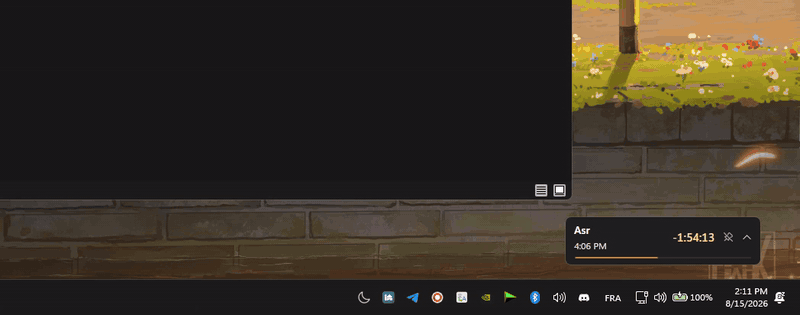

<h1 align="center">ModeSwitch</h1>

  
  
  

A small tray app that toggles light and dark mode with one click.

  Microsoft never added a dark mode toggle to their Quick Settings tiles, so I made one for whenever I go out and need to adjust my screen brightness.

  

